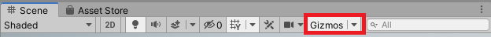
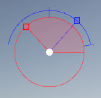

# Conseil Level Design
## Scenes
Il existe une scène de test pour chaque GD de l'équipe.  
Vous les trouverez dans le dossier `Assets/Scenes/LD`.
## GizmosSun
### Instalation
L'outil **GizmosSun** est un petit outil développé spécialement pour Solar. Il permet de gérer directement dans la scène la position du soleil. L'outil est créé pour tester les niveaux sans lancer le jeu.  
Par défaut les scènes dans le dossier LD ont déjà **GizmosSun** activées. Mais si ce n'est pas le cas ou si vous le supprimez par mégarde, vous pouvez l'activer en suivant ces étapes :
* Ouvrez votre scène
* Activez l'options Gizmos :  

* Dans `Project`, récupérez le Prefab `Assets/Resources/GizmosSun`
* Placez le Prefab dans la scène
* Vous devrez voir apparaître l'outils en haut à gauche de la scène :  

### Utilisation
*(Certaines de ces méthodes sont provisoires)*
* **Rotation du soleil**  
Le cercle rouge correspond à la rotation du soleil sur l'axe X.  
Il est éditable en maintenant le clic gauche sur le carré rouge et en déplaçant la souris autour du cercle. Pour arrêter l'édition, il suffit de relacher le clic.  
* **Inclinaison du soleil**  
L'arc de cercle bleu définit l'inclinaison du soleil. L'edition est restreinte entre 90° et une valeur défini dans l'inspector de l'outil. L'édition est similaire à la rotation du soleil.  
* **Déplacement de l'outil**  
En cas de besoin, **GizmosSun** peut être déplacé en cliquant sur le cercle blanc au milieu.   

## ProBuilder
### Préparation à l'utilisation
ProBuilder est déjà importé dans le projet. Vous pouvez l'intégrer à votre éditeur en suivant les étapes suivantes :
* Dans la scène, ouvrez l'onglet `GameObject > 3D Object > Pro Builder Cube (Ctrl + K)`
* Dans l'Inspector du cube, cliquez sur `Open ProBuilder`
* Placez la fenêtre ou vous voulez
### Présentation Vidéo

### [Retour](https://github.com/mathieubecher/Solar)
